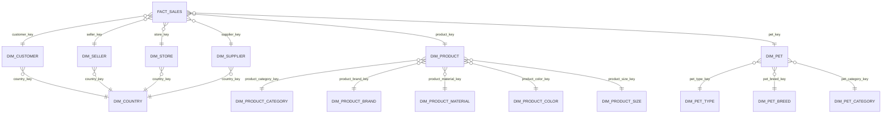

# Решение

Репозиторий дополнен PostgreSQL контуром и SQL слоем для трансформации CSV исходных данных в аналитическую модель снежинка

Основные файлы:

- `docker-compose.yml` - PostgreSQL 16, volume с исходными CSV и скриптами для инициализации
- `sql/init/00_create_stage.sql` - staging-схема, сырая таблица и typed view
- `sql/init/01_load_stage.sql` - загрузка всех 10 CSV файлов в stage.mock_data_raw
- `sql/init/02_build_dw.sql` - запуск DDL и DML для витрины
- `sql/dw/01_create_dw.sql` - DDL фактов и измерений
- `sql/dw/02_load_dw.sql` - DML заполнения измерений и факта из staging
- `sql/dw/03_validation.sql` - контрольные запросы
- `sql/dw/04_analysis_examples.sql` - примеры аналитических запросов

## Чтобы запустить

```
docker compose up -d
```

Проверка:

```
docker exec -i bd_snowflake_postgres psql -U lab -d snowflake_lab -f /sql/dw/03_validation.sql
```

## Модель данных

Зерно факта: одна строка исходного CSV, т.е. одна продажа из источника. Поля id, sale_customer_id, sale_seller_id и sale_product_id повторяются в каждом файле и не являются глобально уникальными ключами

Факт:

- `dw.fact_sales`

Фактическая модель - снежинка: вокруг `dw.fact_sales` оставлены основные измерения, а повторяющиеся справочные атрибуты продукта, питомца и страны вынесены в отдельные нормализованные таблицы.

Измерения:

- `dw.dim_customer`
- `dw.dim_seller`
- `dw.dim_store`
- `dw.dim_supplier`
- `dw.dim_product`
- `dw.dim_pet`
- `dw.dim_country`
- `dw.dim_product_category`
- `dw.dim_product_brand`
- `dw.dim_product_material`
- `dw.dim_product_color`
- `dw.dim_product_size`
- `dw.dim_pet_type`
- `dw.dim_pet_breed`
- `dw.dim_pet_category`

Упрощенная схема:



1. Сырые данные загружаются без потерь в stage.mock_data_raw. Для трассировки добавлены raw_id и source_file
2. Типизация вынесена в stage.v_mock_data_typed: даты, числовые поля и email приводятся централизованно
3. Для продукта и питомца используются hash natural keys, потому что исходные ID повторяются между файлами
4. sale_total_price не пересчитывается насильно (он не бьется с цена * количество). В факте сохранены оба значения: source_sale_total_amount и calculated_total_amount, плюс флаг is_total_consistent
5. Таблицы снабжены primary key, foreign key, unique constraints, check constraints и индексами по основным FK


Контрольный прогон показал:

- stage.mock_data_raw: 10000 строк
- dw.fact_sales: 10000 строк
- Каждый из 10 CSV-файлов загружен по 1000 строк
- Разрывов по foreign key нет
- sale_total_price не совпадает с product_price * sale_quantity во всех 10000 строках, не совсем понятно как это интерпретировать, спишем на data quality issue
